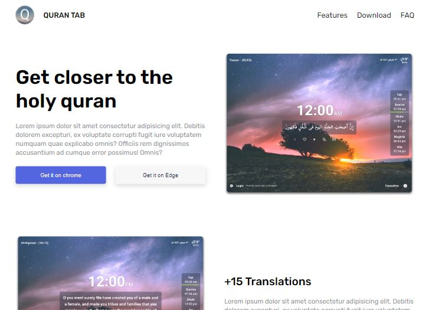

## Overview
This project was apply CSS, and HTML lessons, showcasing proficiency in web development technologies, including HTML, CSS, Flexbox. The goal of this project was to demonstrate skills in creating a responsive and visually appealing web application.

## Technologies Used
- HTML
- CSS
- Flexbox
- SASS (Syntactically Awesome Stylesheets)

## Features
### Responsive Design
The project is designed to be responsive, ensuring a seamless user experience across various devices and screen sizes.

### Flexbox and G
Flexbox  techniques were employed for efficient and flexible positioning of elements, contributing to a clean and organized design.

## Live Website
Visit the live website [My website](https://mahmoudwafdy.github.io/Quran-Tab/).

## Repository
Find the source code in this [GitHub repository](https://github.com/MahmoudWafdy/Quran-Tab).

## Preview
 

## How to Run
1. Clone the repository: `git clone https://github.com/your-username/frontmeetor-challenge.git`
2. Navigate to the project directory: `cd frontmeetor-challenge`
3. Open `index.html` in your preferred web browser.

## SASS Compilation
If you need to make changes to SASS files, compile them into CSS using the following command:
```bash
sass styles/main.scss styles/main.css
